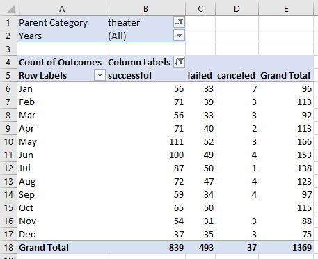
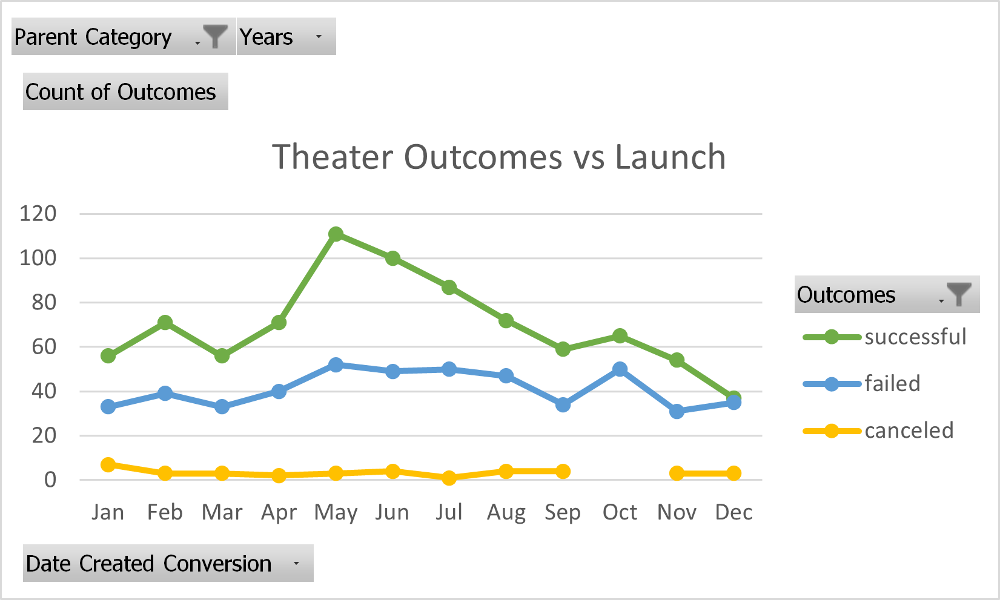
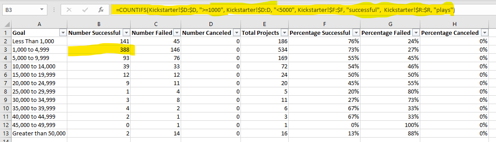
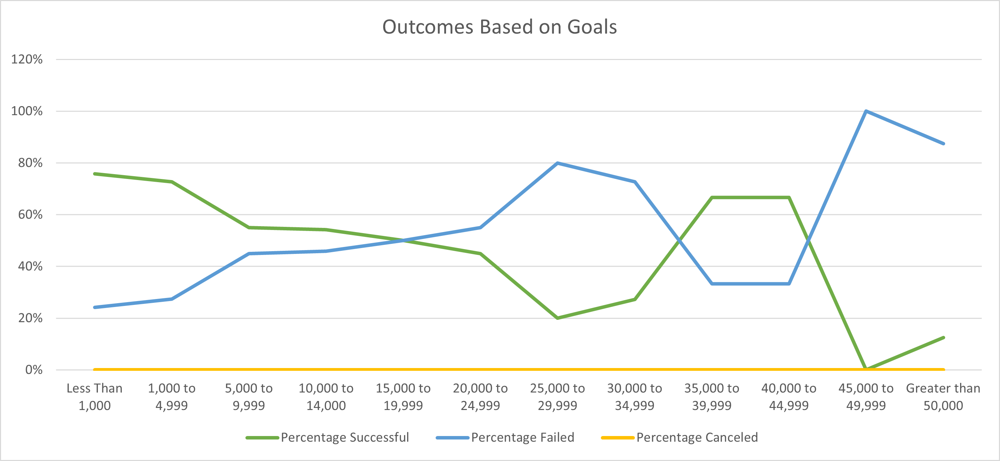

# Kickstarting with Excel

## Overview of Project

### Purpose
Louise wrote a play called "Fever" that she needs to fund using a crowdfunding platform called Kickstarter. The aim of the project below is to provide Louise with an analysis of other Kickstarter campaigns specifically relating to theater. She wanted to know if a campaign's success/failure was correlated to its launch date and fundraising goal.

## Analysis and Challenges

### Analysis of Outcomes Based on Launch Date
Louise wanted to know whether there was a correlation between success and the date a Kickstarter campaign was launched. Specifically, we will look at which months tend to birth success. The table below shows the data which will be visualized later.

 

The data was filtered to only theater Kickstarters. The focus was on number of outcomes for each of the following categories: successful, failed, and canceled. Let us look at the the line graph below to visualize that data.

### Analysis of Outcomes Based on Goals
Louise also wanted to know if a Kickstarter campaign's success depended on the fundraising goal amount. 
The table underneath can be used to follow along as the process is explained.

The focus was placed on three of the possible outcomes: successful, failed, and canceled. The number of successful campaigns was split into ranges to find which goal amounts had the best success, the failed and canceled campaigns were also split into the same ranges. 
The formula highlighted at the top of the image is what was typed in the highlighted cell below. It was used to count how many campaigns there were that fit the conditions: goal amount between 1000 and 4999, successful, plays. Formulas very similar to this one were used in columns B, C, and D. Then, the column total projects was found by summing columns B, C, and D together in their respective rows. To find the percentage, first the formatting for percentage columns was changed to percentage. Second, the data from columns B, C, and D were divided by their respective totals.
Now the table is complete. The chart below displays the results.

### Challenges and Difficulties Encountered
One specific challenge I encountered was with the tab "Outcomes Based on Goals" in cell B13 that calculated the number of successful campaigns with a goal greater than 50,000. This is a relatively simple error but it is a constant with excel. Copying the formula to paste into another cell for small modifications requires extra attention. I had accidentally written a function that solved for goals less than 50,000 instead of greater than. The error was only found when looking at the graph and realizing the shape was off. I looked back at the formula and reminded myself what criteria I was looking for. I hanged the less than symbol, <, to a greater than symbol, >. This was an easy fix but something that could be easily looked over. 
A problem I did not encounter during this project but have many times before is that Excel will not tell you where an error is in your funtion. It only tells you that there is an error. Sometimes, it will tell you what the error was--for example, #DIV/0!--and this helps somewhat, but it is not always the case. Even if Excel returns an error message, it does not tell you if the error was with the data below or the function itself. The only way to fix this problem is by looking at both the function and data yourself. So, being detail oriented when copy pasting and when looking at a function that needs correcting is a must.

## Results

- What are two conclusions you can draw about the Outcomes based on Launch Date? 

(Before we move forward it is imperative to state that the "canceled" line is so close to 0 throughout that graph that it does not bear enough weight to affect successes and failures in any significant way. Therefore, we will not be basing a conclusion around cancelations.)
Conclusion 1. May is the most successful month to launch a Kickstarter. There is an obvious uptick in successes this month. It is also important to note that this the point in the chart where the distance between success and failure is at its farthest. In other words, May is Louise's best chance to fund a successful campaign. There is a 67% chance of success and 31% chance of failure in this month.
Conclusion 2. December is the worst month to launch a Kickstarter. Because the "successful" and "failed" lines almost meet in this month, Louise has the virtually the same chance of failing or succeeding. There is a 49% chance of success and 47% chance of failure in December. 

- What can you conclude about the Outcomes based on Goals?

When looking at the line graph for "Outcomes Based on Goals", at first glance it seems hectic and without pattern. However, by focusing on just the "Percentage Successful" line we can see that it trends downward as the goal amount becomes larger. Then, when focusing on the "Percentage Failed" line it is apparent that the opposite is true. It trends upwards as the goal amount becomes larger. The conclusion here is that, when running a campaign to crowdfund a play, having a smaller goal amount raises the chance for success while having a larger goal amount raises the chance for failure. 

- What are some limitations of this dataset?

One limitation of this dataset is that the data is only from 2009 to 2017. It would be helpful to have data from sooner than that until the current year. This would allow us more data for more accuracy and help us see if the trends are still correct now. In the information Age, trends change quickly so up-to-date data is essential.
Another limitation of the data is that there is no data for what type of advertising the Kickstarters had or how much money they invested in advertising. That could be an important factor toward the success of a campaign.

- What are some other possible tables and/or graphs that we could create?

When analyzing the theater outcomes by launch date, we are looking at all 3 subcategories. To better help Louise, we could add another table and line graph displaying the same results for only plays, leaving out musicals and spaces. This would give her more relevant information for her project.
