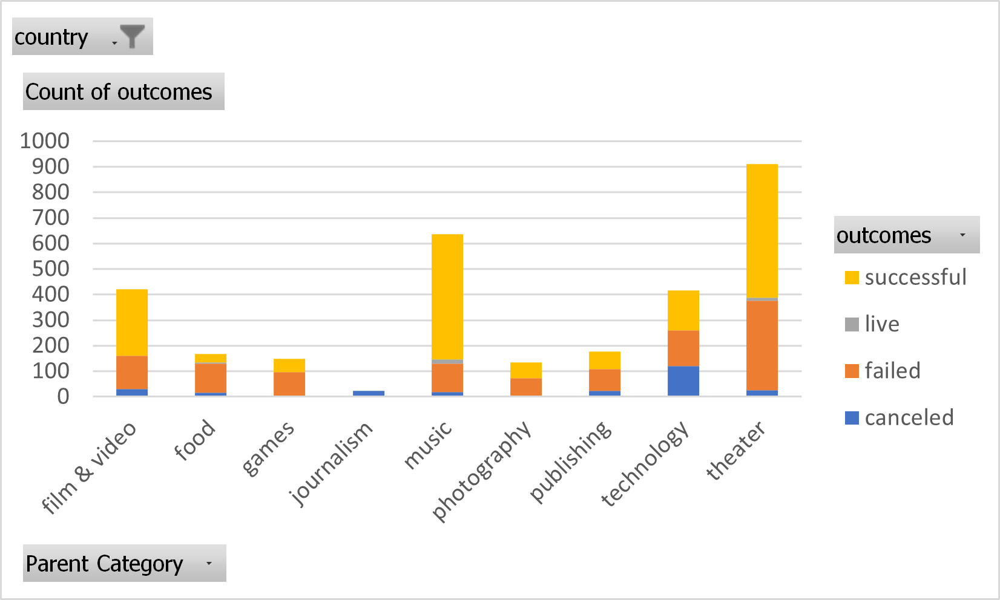

# An Analysis of Kickstarter Campaigns
Below is an analysis of kickstarter data that will help you see which types of campaigns have been successful depending on category, time of the year, country, and fundraising goal.

First, let's look at the chart below which shows all kickstarter campaigns and their number of successes, failures, cancelations, and those that are live.

Within the category of theater, this graph shows 26 canceled, 349 failed, 12 live, and 525 successful campaigns.
This tells us that about 58% of theater kickstarters were successful while 38% failed.

